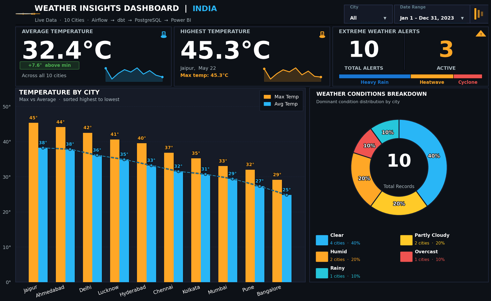

# WeatherFlow: Enterprise Data Engineering Pipeline 🚀

**WeatherFlow** is an enterprise-grade automated Data Engineering ELT pipeline and a complete demonstration of the modern data stack (OpenWeatherMap API → Apache Airflow → PostgreSQL/Snowflake → dbt → Power BI Python Visuals).

It automatically extracts live weather and atmospheric data across 15 major Indian cities, orchestrates the entire workflow locally via Docker, transforms the raw data using a strict Medallion Architecture, and renders a stunning, data-driven Dark Mode dashboard directly inside Power BI using a custom high-DPI Python visualization script.

### 🌟 Key Architectural Highlights
WeatherFlow is a fully automated, cloud-ready data ecosystem.

1. **Automated DAG Orchestration:** Completely replaces manual script execution with **Apache Airflow**. The DAG automatically runs every midnight, fetching live data, handling retries on API failure, and triggering downstream transformations.
2. **dbt Medallion Architecture:** Implements the industry-standard multi-hop architecture. Instead of messy SQL scripts, data moves from **Bronze** (Raw) → **Silver** (Cleaned, Typed, Deduplicated, Tested) → **Gold** (Pre-aggregated KPIs, Heat Indexes, Alerts).
3. **Data Observability:** Uses **dbt tests** to validate data quality (not null, accepted values) before it ever reaches the dashboard, preventing bad data from corrupting the Gold layer.
4. **Code-Driven BI Visualization:** Instead of dragging and dropping basic Power BI charts, this project uses a 300-line custom Python `matplotlib` script injected directly into a Power BI Python visual to generate a stunning, pixel-perfect 1920x1080 dashboard that Power BI alone cannot natively achieve.

---

### 📸 Dashboard Preview
*WeatherFlow — Real-Time Indian Weather Analytics Dashboard*



---

### 🏗️ Enterprise Architecture
This repository models the entire lifecycle of an Enterprise Data Engineering pipeline.

**1. Data Ingestion & Orchestration**
- **Apache Airflow (Dockerized):** Runs the `weather_pipeline.py` DAG. Uses Python operators to fetch live JSON data from the OpenWeatherMap REST API and loads it into the database.

**2. Data Storage & Transformation**
- **PostgreSQL / Snowflake:** The data warehouse where raw data lands. 
- **dbt (Data Build Tool):** Executes SQL models to build the Medallion architecture:
  - `stg_weather.sql` (🥈 Silver): Casts timestamps, converts Kelvin to Celsius, calculates daylight minutes.
  - `mart_city_weather.sql` (🥇 Gold): Calculates the simplified Steadman Heat Index, assigns comfort categories, and aggregates daily metrics.
  - `mart_weather_alerts.sql` (🥇 Gold): Flags extreme heat (>40°C), strong winds, and heavy rain.

**3. Visualization Layer**
- **Power BI Desktop:** Connects directly to the Gold tables in the data warehouse. Uses an embedded Python script (via `matplotlib`) to render the final KPI cards, grouped bar charts, and condition donuts.

---

### 📦 Project Structure
```text
weather-elt-pipeline/
├── airflow/
│   ├── docker-compose.yml       # Docker orchestration for Airflow
│   ├── requirements.txt         # Python dependencies
│   └── dags/
│       └── weather_pipeline.py  # Airflow DAG (Extract -> Load -> dbt)
│
├── dbt_project/
│   ├── dbt_project.yml          # dbt configurations
│   ├── profiles.yml             # Data Warehouse connection profiles
│   └── models/
│       ├── staging/             # 🥈 Silver Layer (stg_weather.sql + tests)
│       └── marts/               # 🥇 Gold Layer (KPIs & Alerts)
│
├── scripts/
│   └── setup_db.sql             # DDL to initialize Database schemas
│
├── .env                         # Secrets (API keys, DB passwords - GitIgnored)
├── DEPLOYMENT.md                # Cloud Deployment Guide
└── powerbi_dashboard.py         # Custom Python code for Power BI visualization
```

---

## 🚀 Deployment Strategies

This project is built to support both free local testing and production-grade cloud deployment.

### Option A: Local Deployment (Free Forever)
For personal practice and portfolio building, you can run the entire ecosystem locally on your laptop. It will only fetch data while your computer is on.
1. **Setup:** Ensure Docker Desktop is installed.
2. **Execute:** 
   ```bash
   cd airflow
   docker-compose up -d
   ```
3. **Manage:** You can turn the pipeline on and off whenever you want using `docker-compose down`. Running it locally costs nothing. AWS is *only* required if you want the pipeline to fetch data while your laptop is closed.

### Option B: Cloud Deployment (AWS Free Tier)
To prove to recruiters that you understand cloud infrastructure, you can deploy Docker to an AWS EC2 instance. 

> [!WARNING]
> **Billing Safety:** The AWS Free Tier provides 750 free hours per month for a `t2.micro` instance (enough for 1 server running 24/7). **However, once you are done showing the project to recruiters or finish interviewing, log into AWS and terminate the instance to prevent any future billing.**

**Step 1: Setup AWS EC2 (The Server)**
Once you are logged into your AWS Console, we need to rent a virtual computer (server) that will run 24/7.
1. In the AWS search bar at the top, type **EC2** and click on it.
2. Click the orange **Launch instance** button.
3. **Name:** Name it `Weather-Pipeline-Server`.
4. **OS Images (AMI):** Select **Ubuntu** (Make sure the badge says "Free tier eligible").
5. **Instance Type:** Select `t2.micro` or `t3.micro` (Whichever says "Free tier eligible").
6. **Key Pair (Login):**
   - Click **Create new key pair**.
   - Name it `my-aws-key`.
   - Keep it as RSA and `.pem`.
   - Click **Create key pair**. *(A file will download to your computer. Keep this safe! We will need it to access the server).*
7. **Network Settings:**
   - Check the box to **Allow SSH traffic from Anywhere**.
   - Check the box to **Allow HTTP traffic from the internet**.
8. Go to the bottom and click **Launch instance**.

**Step 2: Install Docker & Clone Code**
1. SSH into your EC2 instance: `ssh -i "your-key.pem" ubuntu@your-ec2-ip-address`
2. Install Docker and Docker-Compose using standard Linux commands.
3. Git clone your repository onto the EC2 server.

**Step 3: Run the Pipeline 24/7**
1. Navigate to the `/airflow` folder on your server.
2. Run `docker-compose up -d`. Your Airflow scheduler is now running in the cloud!

---

### 🛠️ Tech Stack
| Category | Technology |
|----------|------------|
| **Orchestration** | Apache Airflow (Docker) |
| **Data Warehouse** | PostgreSQL / Snowflake |
| **Transformation** | dbt Core (Medallion Architecture) |
| **ETL scripting** | Python, Pandas, Requests |
| **Visualization** | Power BI, Matplotlib |

---
*Built as a professional portfolio project demonstrating real-world enterprise data engineering practices.*
